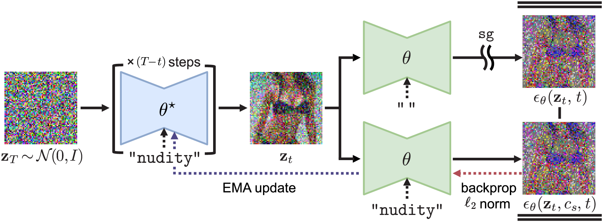

# Safe self-Distillation Diffusion (SDD)

The official implementation of the paper "Towards Safe Self-Distillation of Internet-Scale Text-to-Image Diffusion Models" (ICML 2023 Workshop on Challenges in Deployable Generative AI)



## How to Run

### Installation

In order to minimize other dependencies and ensure generalization to other models in the future, our code runs based upon HuggingFace's Diffusers library with PyTorch. If you already installed Diffusers and Trnasformers, you are good to go! If not, it is recommended to upgrade PyTorch to version 1.13. Then, you can install required libraries as below. For further instruction, please check [https://huggingface.co/docs/diffusers/installation](https://huggingface.co/docs/diffusers/installation) and [https://huggingface.co/docs/transformers/installation](https://huggingface.co/docs/transformers/installation). You don't need the Accelerate library, but it is recommended for memory-efficient model loading and other features. For simplicity, our code does not support Accelerate's multi-GPU training features.

```bash
pip install transformers diffusers accelerate
```

### Instruction

After installation, download this repository to your local environment or `git clone` it, and move to the `safe-diffusion` directory.

You can run our method Safe self-Distillation Diffusion (SDD) with the example script.

```bash
bash run_sdd_nudity.sh
```

We re-implemented Erasing Stable Diffusion (ESD) with HuggingFace's Diffusers library, and you may run it as well. Refer to the original repository ([https://github.com/rohitgandikota/erasing](https://github.com/rohitgandikota/erasing)) and the paper ([https://arxiv.org/abs/2303.07345](https://arxiv.org/abs/2303.07345)) for more information. Please note that our code may work differently, and we welcome any suggestion or modification to it. If you have any, please send a pull request, create an issue, or email me.

```bash
bash run_esd_nudity.sh
```

In order to run both methods, you need to have at least 24GB of VRAM on your GPU, if you only train cross-attention layers (~5% of the total parameters). You need more VRAM if you want to try full fine-tuning. You may split load the student and the teacher model to different GPUs, but it still requires at least 16GB VRAM for fine-tuning cross-attention layers. 


